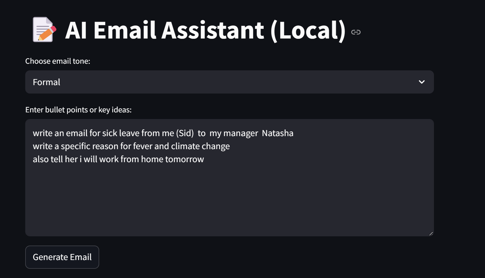
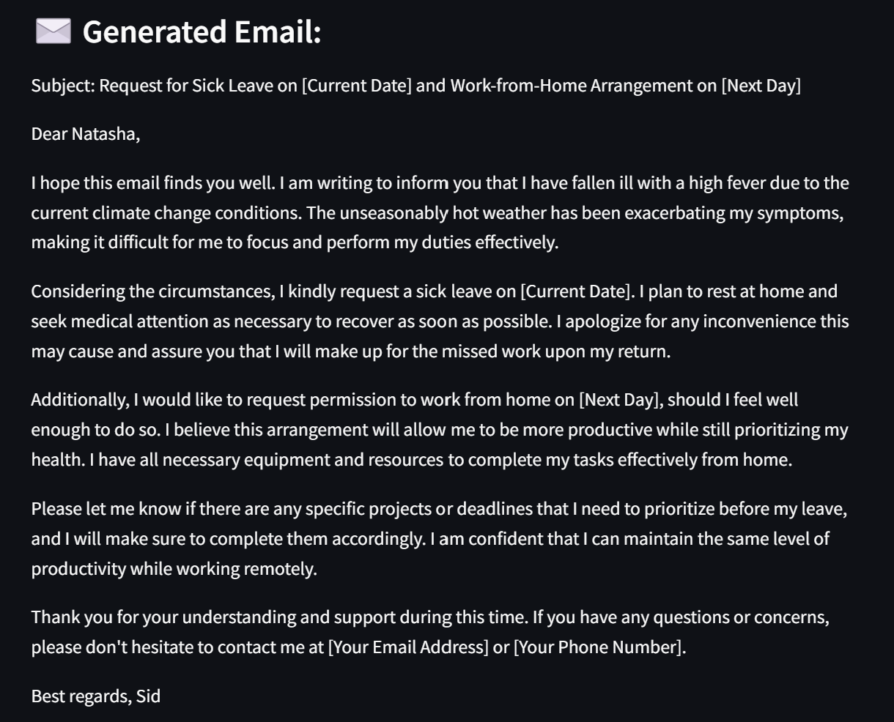

# 📝 AI Email Assistant (Powered by Local LLM)

This is a lightweight AI tool to generate professional emails from bullet points using open-source LLMs via [LM Studio](https://lmstudio.ai). Works entirely offline — no OpenAI API or cloud needed!

## 📸 Screenshots

| UI | Output |
|----|--------|
|  |  |

## 🚀 Features

- Generates emails from simple bullet points
- Choose tone: Formal, Friendly, Apologetic, Confident
- Powered by local models (e.g., Mistral-7B via LM Studio)
- Built with Python + Streamlit

## ⚙️ Setup Instructions

1. Clone the repo:
   ```bash
   git clone https://github.com/Natdan24/AI-Email-assistant.git
   cd AI-Email-assistant
